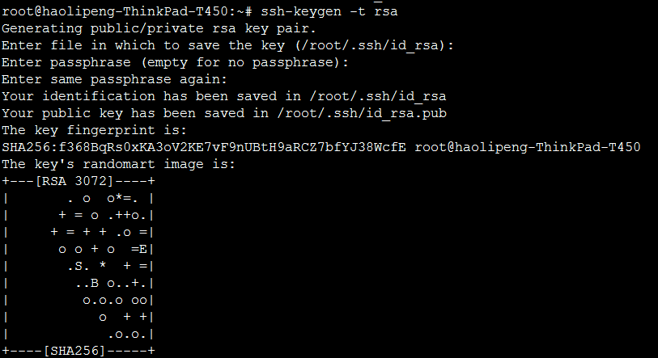

Elkied单机部署文档

进行单机部署，有利于更好的理解各个组件。


# 一、配置ssh免密登录

## 1、生成密钥

```
ssh-keygen -t rsa
```



执行上面的命令时，我们直接按三次回车，之后会在用户的根目录下生成一个 .ssh 的文件夹，我们进入该文件夹下面并查看有哪些内容。


我们看到有三个文件，下面分别解释下每个文件是干什么用的。

id_rsa: 生成的私钥文件

id_rsa.pub: 生成的公钥文件

known_hosts: 已知的主机公钥清单

## 2、拷贝密钥

```shell
scp -p ~/.ssh/id_rsa.pub root@:/root/.ssh/authorized_keys
```

以上步骤，我们就完成了免密钥登录.


# 二、下载安装包和部署脚本

## 下载部署脚本

```
wget https://github.com/bytedance/Elkeid/releases/download/v1.7/elkeidup
chmod a+x ./elkeidup
```


## 下载安装包

```
wget https://github.com/bytedance/Elkeid/releases/download/v1.7/package_community.tar.gz
tar -zxf package_community.tar.gz
```

这个脚本下载的比较慢，我上传到了百度网盘上。


# 三、修改脚本

修改agent_center的install.sh脚本

修改mongodb的install.sh脚本


# 四、编译构建agent


# 五、常见问题汇总


